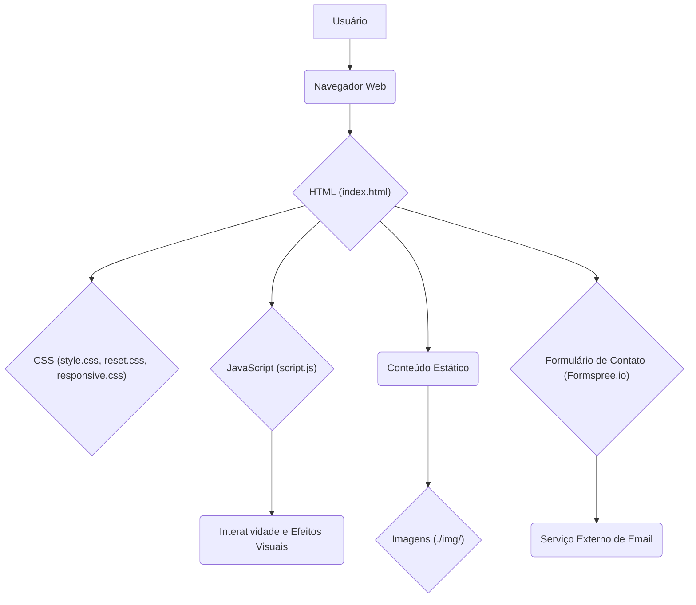

# Portfólio Pessoal

Este repositório contém o código-fonte do meu portfólio pessoal, uma aplicação web estática desenvolvida para apresentar meus projetos, habilidades e trajetória profissional. O objetivo é fornecer uma visão abrangente das minhas capacidades como desenvolvedor, com foco em design responsivo e interatividade.

## Funcionalidades

O portfólio inclui as seguintes seções e funcionalidades:

*   **Seção Home:** Boas-vindas interativas com efeito de máquina de escrever.
*   **Seção Projetos:** Exibição de diversos projetos com descrições, links para demonstrações e código-fonte, utilizando animações de revelação ao rolar a página.
*   **Seção Sobre Mim:** Apresentação pessoal e linha do tempo da minha trajetória acadêmica e profissional.
*   **Seção Contato:** Formulário de contato integrado com Formspree.io para facilitar a comunicação, além de informações de contato direto.
*   **Navegação Responsiva:** Menu hambúrguer para dispositivos móveis e navegação suave entre as seções.
*   **Design Moderno:** Utilização de CSS para um layout limpo e visualmente atraente.

## Tecnologias Utilizadas

*   **HTML5:** Estrutura semântica do conteúdo.
*   **CSS3:** Estilização e responsividade (incluindo `reset.css`, `style.css`, `responsive.css`).
*   **JavaScript:** Interatividade, efeitos visuais (máquina de escrever, revelação ao rolar) e manipulação do menu de navegação.
*   **Font Awesome:** Ícones para melhorar a experiência do usuário.
*   **Formspree.io:** Serviço para gerenciamento de envios do formulário de contato.

## Estrutura do Projeto

A estrutura do repositório é organizada da seguinte forma:

```
Portifolio/
├── LICENSE           # Informações sobre a licença do projeto
├── README.md         # Este arquivo
├── index.html        # Página principal do portfólio
├── reset.css         # Folha de estilo para resetar padrões do navegador
├── style.css         # Estilos globais do portfólio
├── responsive.css    # Estilos para responsividade
├── script.js         # Lógica JavaScript para interatividade
└── img/              # Diretório para imagens do portfólio
    ├── Projeto1.png
    ├── Projeto2.png
    ├── Projeto3.png
    ├── Projeto4.png
    ├── Projeto5.png
    ├── Projeto7.png
    ├── github.png
    ├── linkedin.png
    ├── perfil.png
    ├── perfil2.png
    └── perfil3.png
```

## Arquitetura do Sistema

O portfólio é uma aplicação web estática, o que significa que a maior parte do processamento ocorre no lado do cliente (navegador). A arquitetura pode ser visualizada como um fluxo de interação entre o usuário, o navegador e os recursos do servidor (para entrega dos arquivos estáticos e o serviço de e-mail).



**Explicação da Arquitetura:**

*   **Usuário:** Interage com a aplicação através de um navegador web.
*   **Navegador Web:** Carrega e renderiza os arquivos HTML, CSS e JavaScript.
*   **HTML (index.html):** Define a estrutura e o conteúdo da página.
*   **CSS (style.css, reset.css, responsive.css):** Controla a apresentação visual e o layout, adaptando-se a diferentes tamanhos de tela.
*   **JavaScript (script.js):** Adiciona interatividade, como o efeito de máquina de escrever, animações de rolagem e o comportamento do menu de navegação.
*   **Conteúdo Estático (Textos, Imagens):** Elementos visuais e textuais que compõem o portfólio.
*   **Imagens (./img/):** Diretório onde as imagens dos projetos e perfil são armazenadas.
*   **Formulário de Contato (Formspree.io):** O formulário HTML envia os dados diretamente para o serviço Formspree.io, que gerencia o envio de e-mails sem a necessidade de um backend próprio.
*   **Serviço Externo de Email:** Formspree.io processa e encaminha as mensagens enviadas pelo formulário.

## Como Visualizar o Portfólio

Este é um site estático e pode ser visualizado diretamente no navegador. Você pode:

1.  **Clonar o Repositório:**

    ```bash
    git clone https://github.com/GilvanPedro/Portifolio.git
    ```

2.  **Abrir o `index.html`:** Navegue até a pasta clonada e abra o arquivo `index.html` em seu navegador de preferência.

Alternativamente, você pode acessar a versão hospedada diretamente pelo GitHub Pages (se configurado) ou por qualquer outro serviço de hospedagem de sites estáticos.

## Licença

Este projeto está licenciado sob a Licença MIT. Consulte o arquivo [LICENSE](LICENSE) para mais detalhes.

## Autor

*   **Gilvan Pedro** - [GitHub](https://github.com/GilvanPedro)
